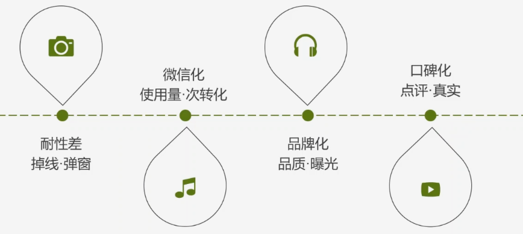

# SEM

> Search Engine Marketing, 搜索引擎营销

根据用户使用搜索引擎的方式利用用户检索信息的机会尽可能将**营销信息传递给目标用户**。基于搜索引擎平台的网络营销，利用人们对搜索引擎的依赖和使用习惯，在人们检索信息的时候将信息传递给目标用户。搜索引擎营销的基本思想是让**用户发现信息**，并通过点击进入网页，进一步了解所需要的信息。企业通过搜索引擎付费推广，让用户可以直接与公司客服进行交流、了解，实现交易。

- SEM=SEO + PPC
- PPC=Pay Per Click 点击付费广告（针对广告主，百度、360、搜狗）
- CPC：Cost Per Click 点击付费广告（针对发布者）

## 竞价推广

> 搜索引擎衍生出来的广告服务。是一种网络营销服务，帮助企业在网络上宣传产品或业务。企业的推广信息会展现在百度搜索结果页上，吸引网民点击访问客户网站。

### 竞价优势

- 按点击付费、推广费用较低（展现不收费）
- 预算灵活控制
- 广告形式简单、降低制作成本
- 广告位可以自行选择
- 广告信息可以随时调整更换
- 可以随时查看广告效果统计报告

### SEM广告

- 搜索推广（管理关键词）
  - 搜索列表左列关键词“推广”位
  - 搜索列表左列关键词上线“推广链接”位
    - 封条图文（Logo）
    - 细径（导航）
  - 右侧关键词推广链接位
  - 相关推广
- 网盟推广（联盟图片）

----

## SEM竞价推广更新知识

### 搜索广告现状及趋势

- 口碑化
  - 百度知道
  - 大众点评
  - 电商（淘宝评论）

- 共性+独特

**快、准、狠**

### 百度推广新增产品及功能解析

#### 百度推广 - oCPC 以转化目标为优化目的的点击出价，计费方式为按点击计费

#### oCPC 对接方式

#### 百度统计转化设置目录

- 统计转化**次数**
- 转化**数据呈现**

- 转化
  - 访客在网站完成了某项您期望的活动，记为一次转化，如注册或下载
- 业务目标类型
  - 获取客户：在线注册、创建账号
  - 增长收入：在线订单、付款成功
  - 沟通咨询：咨询、留言、电话
  - 互动行为：视频播放、加入购物车、分享

- 转化数据的应用
  - 在报告的自定义指标中勾选指标，实时掌握网站推广及运营情况
  - 结合“全部来源”、“转化路径”、“页面上下游”等报告分析访问漏斗，提高转化率
  - 对“转化目标”设置价值，预估转化收益，衡量ROI

- 页面转化：访客访问了特定页面，如注册完成页，支付完成页等
- **事件转化**：访客执行了指定的操作，如注册、购买、下载、播放等
- 时长转化：访客在网站上停留时间超过了指定时间
- 页数转化：访客打开网站的总页数超过了指定数量

- 百度统计->网站统计->管理->转化设置
  - 基本转化设置
  - 长效转化设置

[百度助手里查看](./images/baidu-helper.png)

- 选定转化标准
- 寻找独立元素id

----

## 广告展现形式

- banner广告
  - 多用于提示性广告，容量一不安不超过2K
  - 常用尺寸
    - 120*90，产品演示或大型Logo
    - 120*60， 用于Logo
    - 88*32，网页链接或小型logo
- 富媒体广告- Rich Media
  - 声音、图像、文字等多媒体组合的媒介形式
- 视频广告
  - 强迫性广告，相对于弹出式广告，比弹窗略显友好
- 赞助式广告 - 加多宝
  - 内容赞助
  - 节目赞助
  - 频道合作赞助
- 弹出式广告
- 文字链广告
  - 指向广告主指定的网页超链接
- 画中画广告（文章和广告混杂在一起）
  - 为客户量身订作的迷你网站，大大增强了广告的命令率
  - 主要网站的内容页面比如新闻、文章的页面投放
- 电子邮件广告
  - 针对性情、传播广、承载信息量大
- 墙纸、屏保广告
  - 桌面或屏保能占据用户计算机的整个桌面，屏保更能以全屏的方式播放动画，甚至能配上声音。桌面或屏保广告是一种非常好的广告载体。
- 软件客户端
  - 360安全卫士
- 搜素引擎竞价
  - 百度
  - 360
- 分类信息
- 植入式广告
  - 在游戏，视频等中植入广告信息

----

## 网络广告计费方式

- 按点击数计费
  - CPM
  - CPC：点击付费
- 按效果计费（注册量）
  - CPA
  - CPR
  - CPP
  - FPF
- 按时间计费（按时间）
  - CPD
  - CPT
- 其他方式计费
  - CPL
  - CPS：阿里妈妈（按成交量，佣金提升）

----

## 网络广告策划流程

1. 确定广告目标
2. 指定广告预算
3. 选择媒体渠道
4. 制作广告创意

### 确定广告目标

> 树立目标，明确目的

原则：**量化、可实现**

- 1.你是谁
- 2.你想做什么
- 3.你想跟谁说
- 4.你想呈现什么

销售产品、网站流量、品牌传播、危机公关

### 指定网络广告预算

- 目标->预算
  - 简单粗暴预估预算方法：
    - 目标：没有开发200个新用户，预估单用户成本500元，广告预算：100000元

- 常用置顶预算方法
  - 根据经验
  - 相关数据（行业报告）
  - 测试后制定
  - 根据传统渠道的比例指定(1/3)

### 选择媒体的渠道

- 目标**用户聚集**渠道
- 目标网站**频道流量**
- 投放目标**页面内容质量**
- **集群**作战长尾效应（游击战策略）

新浪->zhongyi.sina.com

### 制作广告创意

- 足够的**冲击力**
- **一句话**，提现用户利益

1. 制作网络广告投放简单方案（预算、投放渠道平台选取）
2. 注册、搭建简单SEM账户（百度、360、搜狗），要求：建立一个推广计划，一个推广单元，添加15个词性一致的关键词即可；账户设置2000元投放限额，设置北京、天津、河北（仅投放承德、保定、其他河北地区不投放）；设置账户投放推广时间段为：早8：00到晚上18:00点

- 医疗行业：眼科
- 教育行业：出国留学
- 机械行业：包装机械
- 物流行业：物流公司

----

## 账户开户费用

> 需要资质

- 推广费用
  - 百度
  - 搜狗
  - 360

----

## 预算分配

- 搜索引擎使用情况分析报告

- [百度后台登录](http://www2.baidu.com)
- [搜狗后台登录](http://fuwu.sogou.com)
- [google后台登录](http://adwords.google.com)
- [360后台登录](http://e.360.cn)

----

## 账户推广流程

1. 物料准备阶段
2. 账户搭建阶段
3. 账户推广阶段

### 物料准备阶段

- 关键词的准备
  - 确定关键词目标方向
  - 挖掘关键词
- 创意的准备
  - 根据关键词撰写相关创意广告
- URL 的准备
  - 搭建网站
  - 根据关键词和创意设计相关着陆页

### 账户搭建阶段

- 添加关键词
  - 在账户中添加关键词
  - 账户中的关键词设置：出价、匹配模式、URL
- 添加创意
  - 在账户中添加创意、设置创意URL
- 账户相关设置
  - 时段设置
  - 区域设置
  - 预算设置

### 账户推广阶段

- 推广效果评估
- 数据报告解读与分析
- 账户推广优化

----

## SEM 账户结构

### 账户结构介绍

### 账户基本设置

### 账户工具使用

### 简单账户搭建

### 关键词设置

### 创意样式与撰写技巧、实操搭建基本健全账户

### 网盟推广

### 移动推广（搜索+网盟）与百度后台移动建站

### 推广助手

### 百度商桥及百度离线宝

### 品牌广告

---