# SEO

## 学习SEO的意义

- 就业：通过SEO获得高新岗位
- 网络兼职：利用电脑上网兼职赚钱
- 创业：学习网络创业的原理

## 主流网站与搜搜引擎

- 新浪：s.weibo.com（微博搜索）
- 搜狐：sougou.com（搜狗）
- 腾讯：soso.com（搜搜）
- 网页：youdao.com （有道）
- 奇虎360：so.com (360搜索)
- 天猫：yitao.com（一淘）

## 流量

> 网站流量，网站的访问量

### 得到流量的方式

- 创造流量
  - 淘宝流量：品牌宣传和推广；草根创业者，创造流量不显示
- 获取流量
  - 现有的流量吸引或者引导到我们的网站上
    - 花钱投广告
    - 跟帖发广告
    - QQ群发广告
  - 搜索引擎是网络上最重要的流量入口之一：百度
  - 搜素引擎聚集了大量可利用的流量
    - 关键词搜索结果的首页，拥有最高的可用流量。搜索引擎上面获得稳定流量，就必须使我们的页面出现在关键词搜索结果的前2页，最好是首页。

### 如何在搜索上获取流量

- 付费排名（百度推广）
- 自然排名（SEO）

### 定向流量

- 转化率比较高的流量
  - 卖女装的网站：寻找汽车配件的人浏览您的网站，这些流量肯定不是定向陆良
- 搜索引擎的定向流量
  - "女装“关键词在百度首页的话，每天在百度搜索”女装“这个词的人有几千人，那么肯定会有很多人来到您的网站，而这些人就是冲着”女装“来的，这就是定向流量。

## robots.txt

> robots 协议（爬虫协议、爬虫规则、机器人协议等），网站通过 robots协议告诉搜索引擎哪些页面可以抓取，哪些页面不希望被抓取

- Robots协议是网站国际互联网界同行的道德规范，其目的是保护网站数据和敏感信息、确保用户个人信息和隐私不被侵犯
- 因其不是命令，故需要搜索引擎自觉遵守

- `User-agent: *` 搜素引擎种类，*是通配符
- `Disallow: /admin/` 进制爬虫admin目录下面的目录
- `Disallow: /*?*` 禁止访问网站中所有包含问好的网址
- `Disallow:/.jpg$` 禁止爬取网页中所有的.jpg个会图片
- `Disallow:/ab/adc.html` 禁止爬虫ab目录下面的abc.html 文件
- `Allow: /cgi-bin/` 允许爬虫cgi-bin 目录下的目录
- `Allow: .html$` 仅允许访问已".htm"为后缀的URL
- `Allow: .gif$` 允许抓取网页和gif格式图片
- `Sitemap: 网站地图` 告诉爬虫这个页面是网站地图

## SEO tools

- [百度站长Robots检测](https://ziyuan.baidu.com/robots/index)
- [百度站长Robots检测](https://ziyuan.baidu.com)
- [站长工具Robots文件生成](http://tool.chinaz.com/robots)
- [爱站网](https://www.aizhan.com/)
- [安全检测](http://tool.chinaz.com/webscan)
- [安全联盟]https://anquan.org
- [SEO](http://tool.seowhy.com/)

## SEO 分类

- 白帽：公平的、符合主流搜索引擎方针规定的SEO优化方法
- 黑帽：操作手法不符合主流搜索引擎发行方针规定
- 灰帽：白猫与黑猫的灰色地带

### 白帽SEO

> 通过正常的手段对**网站内部**（网站标题、网站结构、网站代码、网站内容、关键字密度等）调整、**网站外部**的链接建设，来提高网站关键字在搜索引擎排名的一种SEO技术。白帽SEO优化的生效时间较长，优化：**排名稳定，浮动不大，不同担心因为SEO操作而降权**

- SEO 家园
  - SEO
  - 邮件
  - 调研白皮书
  - 咨询图片
  - 社交网络
  - 研讨会
  - 文档分享
  - 口碑
  - 博客
  - 问答网站
  - 直接流量
  - 直接/推荐链接
  - 社会化书签
  - 论坛
  - 在线视频
  - 评论营销
  - 写博客
  - 新闻/媒体/公关

- 结构优化
- 关键词优化
- 内部优化
- 外部链接优化

### 黑帽SEO

> 利用搜索引擎漏洞，通过作弊手法快速达到搜索引擎排名的SEO方法

**轻则降权 重则被 K**

- 黑帽SEO手法
  - 桥页跳转
  - 关键词堆砌
  - 隐藏文本、关键词
  - 建立镜像 重复或像是页面过多
  - 疯狂的垃圾链接（Spam）
  - 细微文字
  - 障眼法
  - 真得“黑”了

#### 桥页

> 过渡页，是指一个页面打开之后会自动或手动专向到别的页面。主要是针对搜素做的，一些SEOer通过优化过的桥页堆砌大量的关键词链接到目标页，利用搜索引擎漏洞，达到快速排名的目的。

#### 关键词叠加、关键词对切

> 从网页标题 `title`到meta的`keywords`，再到**文章内容**、**底部版权**、**关键词**无孔不入，根本不讲究一个合理分布，这样的网页对用户来说没有任何意义和价值，首先，用户的阅读兴趣就被你夸张的关键词密谋“暗杀”。过分**重复使用关键词**

- 推荐
  - 首页keyword: 5个左右

#### 隐藏文本、关键词

> 一般用于首页头部，正常不会受到搜索引擎惩罚，如果以类似方式在页面中堆砌关键词，肯定会被搜搜引擎出名的。

- 文字和背景颜色一样

#### Spam

> 高质量外链=高权重的网页来的外链 + 高相关性网页来的外链

#### 细微文字

> 隐藏文字会遭到惩罚，所有将文字的字体在网页中设置到不起眼的地方，甚至小的看不见，一般会放在网页**顶端或底部**

#### 障眼法

制作对用户无用或看不到的网页，里面堆满了关键词，而搜索引擎却能看到，搜索引擎对这种掩耳盗铃的做法对车：封

## 降权

> 搜索引擎给网站评定的级别下降了，也是搜素引擎对网站进行的一种触发方式

- 特征表现
  - 网站部分**收录内容减少**
  - 网站**排名**大幅**下降**
  - 搜索引擎**快照更新速度降低**
  - 网站**首页被屏蔽**
  - 网站**全部页面删除**

### 降权怎么办

- 检查**重复关键词、ALT、内容**
- 检查有没有**不良友情链接**
- 检查网站**源文件是否有黑客进入**
- 检查网站**title修改**
- 新站**稳定性不高**，如有以上几点今早去掉

### 网站被百度谷哥降权怎么把

- site: 域名，判断沙盒效应
- 检查**关键词的密度**，`title, keywords` 关键词是否合理
- site 不存在(被K)，重新设计被K的页面，**合理布局关键词，增加一部分外链**

### 网站优化精髓

- **内容**为王
- **用心**经营内容
- 最好不要作弊

### 百度搜素引擎搜索习惯

- 较重视**第一次收录印象**
- 对**网页的更新**较敏感（文章活跃）
- 较**重视首页**
- 较**重视收录日期**

## UEO

### 四大要素

- 网站速度
- 文章排版
- 网站死链接
- 内容更新与维护

### 网站用户体验的分类

- 感官体验：视听上的体验，强调舒适性
- 交互体验：用户操作上的体验，强调易用/可用性
- 情感体验：用户心理上的体验，强调友好性
- 浏览体验：用户浏览上的体验，强调吸引性
- 信任体验：用户信任体验，强调可靠性

## 原创

- 什么是原创
- 掌握伪原创的方法
- 什么是网站规律更新

### 什么是原创

> 作者首创，并非抄袭模仿的。**内容**和**形式**都具有**独特个性**的**物质**或**精神**成果。

在SEO中，原创不一定要自己写，你要你发表的内容是搜索引擎没有收录的，对于搜索引擎来说就是原创。

### 原创文章的目的

- 让搜索引擎知道网站是活跃的（一片原创文章带动整个网站）
- 希望带网站链接的原创文章被转载、被采集
- 让更多人认识并了解网站

### 原创的好处

[SEO综合查询](http://seo.chinaz.com)

- 提高网站**权重**
  - 搜索引擎通过算法判断，原创文章为高权重页面，网站内**高权重页面**增多了，网站权重页就提高了
- 增加网站**收录量**
  - 原创文章更容易被收录，长期坚持原创更新，收录量会持续增加
    - **搜索引擎-收录**
- 增加网站**流量**
  - 原创文章页面权重较高，权重高的页面排名更容易靠前，被访问的机率增加，网站原创文章多了自然网站流浪页增加了
    - **百度流量统计**
- 增加网站**外链**
  - 远程文章容易被转发，文章内部设置自己网站的链接也可能一起被转载，所以说原创文章可以正价网站外链
  - [反链查询](http://outlink.chinaz.com)
  - 网站外链：反向链接或导入链接，是指从别的网站导入到自己网站的链接
- 提高**用户体验**
  - 新的原创高质量文章容易吸引用户阅读，并带来用户的再次光临，所有说原创文章可以提高用户体验

### 如何做原创

- 原创内容要与网站主题相关
  - 根据各页面目标关键词或相关关键词拓展文章
  - 根据时下相关的热门词汇，结合长尾关键词来撰写文章

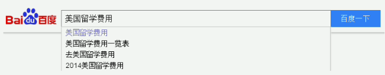

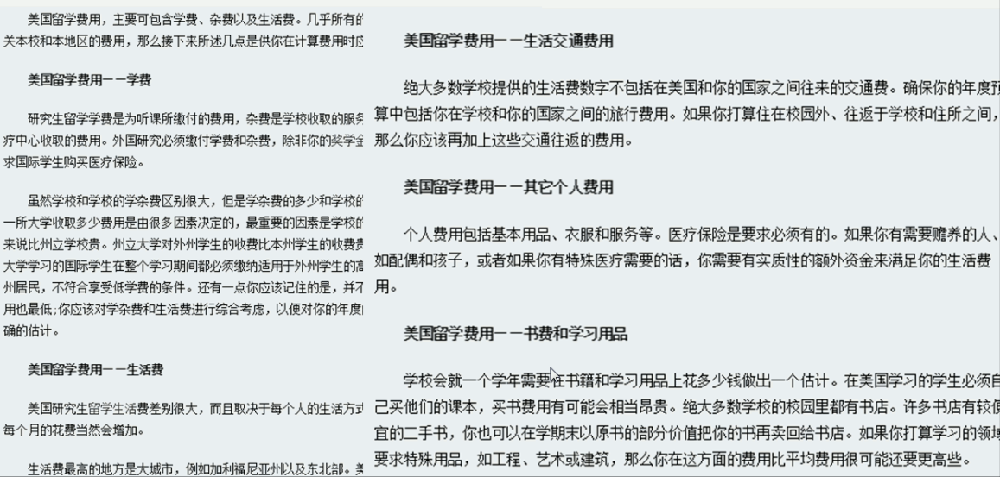

#### 原创文章的基本标准

- 标题包含目标关键词
- 内容中穿插目标关键词
- 尽量使用概括性小标题

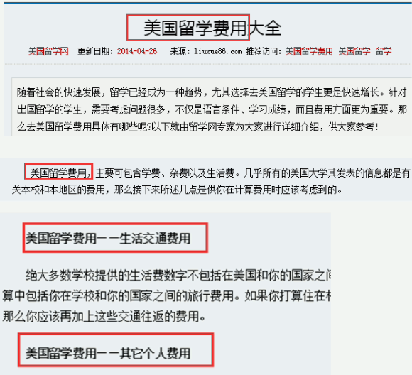

#### 原创文章写作要点

- **标题要标准、简洁** —— 包含目标关键词
- **文笔要多变** —— 使用点缀关键词长尾关键词
- **融入个性化风格** —— 生动活泼、利于用户阅读
- **少用空洞的词汇** —— 有内涵，使用，有明确的观点
- **尽量使用小标题** —— 二、三级标题
- **带有煽动性的情感** —— 吸引用户、引动用户

#### 原创的难点

- 原创要求作者有丰富的**行业知识和经验**
- 原创要求作者要有好的**文字功底**
- 原创需要作者花费大量的**时间和精力**

> 既然原创对于站长来说有一定的难度，那么站长应该怎么办？

原创固然好，但难度也高，退而求其次，可采取伪原创的方式更新，已达到原创的效果

## 伪原创

> 根据现有的文章进行再加工，使其让搜索引擎认为是一篇原创文章

### 伪原创分级

- 一级：最初级，仅仅是对**标题修改**，处理一些**错别字**（不建议使用）
- 二级：不仅仅修改文章标题，对**段落或文件还进行重新排列**，或是**同义词**的替换等（也不建议使用）
- 三级：不仅对文章的标题进行修改，对段落或文字进行重排，还**加入其它的信息**，丰富了文章的内容
- 四级：加入**自己网站的相关文稿信息，配以图片**等

### 如何伪原创

- 修改标题
  - **拆分法**
    - 原则：原标题中**词语拆分成单个词**，保留**关键词**，在进行创作
    - 例如：原文章标题“美国留学6大必备常识”
      - 伪原创标题：“美国留学6大常识” **No**
      - 伪原创标题：“美国留学必备6大常识” **No**
      - 伪原创标题：“美国留学6大常识你就会爱上美国留学” **Yes**
      - 伪原创标题：“去美国留学6项关键常识” **Yes**
  - **颠覆法**
    - 原则：重新从关键词角度考虑命名，颠覆原有标题
    - 例如：原文章标题“美国留学费用”
      - 原文章标题：“2019年美国留学费用详解-机构名”
      - 原文章标题：“2019年美国留学一年要花多少钱？” **Yes**
- 修改内容
  - **首段自创法**
    - 自己写首段，就像阴阳的作用一样，在看完全文后，做个总结放在首段，最好带上自己网站的关键词
    - 首段字数不少于100字
  - **段落调整法**
    - 调整文章段落顺序，可以倒叙或者穿插方式修改段落出现的顺序
      - 段落12345， 调整后54321或者45213
  - **词语替换法**
    - 使用意思相近的词语代替原来内容中的词语
    - 例如：“今天下午，万里无云心情也格外开朗”，可以改成“今日，清空万里很惬意的一个下午”
  - **文字排序法**
    - 通过打乱文字顺序让内容看起来不一样
    - 例如：原内容为“必须靠近水源，才可以生存下去”，可以改成“想生存就要居住在临近水源的地方”
  - **数字替换法**
    - 通过修改内容中的数字
    - 原内容是“引发1998年以来的最大的洪水”，可以改成“引发九八年最大洪涝灾害”
  - **修改尾段法**
    - 同首段一样，修改尾端。可以用自己的话对整片文章做个总结，已降低网页的相似度，最好带上自己网站的关键词。

总结-描述-总结

### 创建伪原创的方法

- 翻译文章：其他语种翻译为中文或繁体翻译为简体
- 抢文章：博客论坛等不知名人物的新文章
- 摘抄文章：线下书籍杂志/内容 filetype: pdf
- 寻找屏蔽搜索引擎的知名网站

### 练一练

- 伪原创一篇不少于300字的文章
- 伪原创文章包含1个目标关键词
- 设置3个概括段落的小标题（段落左上方）
- 内容穿插目标关键词，页面目标关键词密度要在2%-8%之间

## 采集工具

- [火车头采集](http://www.locoy.com)
- [狂人采集器](http://www.kuangren.cc)
- [百度搜索引擎网页质量白皮书](./百度搜索引擎网页质量白皮书.pdf)

## 站内链接

### 什么是网站内链

> 同一网站域名下(包括二级或三级)的内容页面之间相互链接

合理的网站内链接构造，能提高搜索引擎的收录于网站权重

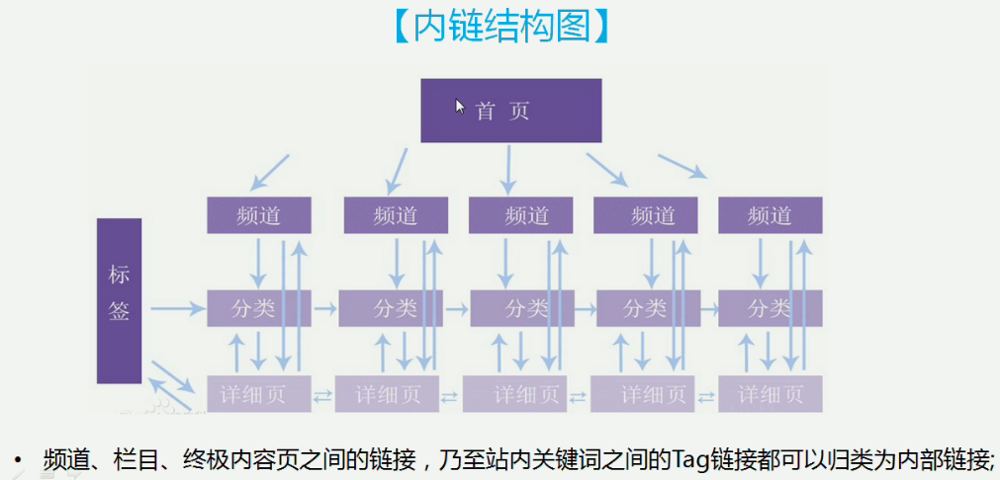

### 网站内链作用

- 提升用户体验
  - 在相关页面设置对应的页面链接，浏览会变得非常顺畅。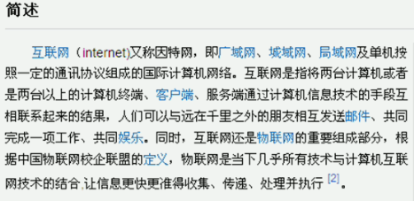
  - 链接设置不合理，有的页面干脆没链接，只能重新输入网址才能再访问其他页面，这种体验会非常差
  - 内链优化可以提升用户体验
- 增加网站收录
  - 搜索引擎蜘蛛对互联网的爬行抓取是需要花费非常多资源的，如果站内链接设置不合理，有可能造成服务器资源的浪费，蜘蛛爬行并不是每次都爬全站，而是有选择的爬，同等情况下内链设置合理的网站更容易被搜索引擎抓取到新内容。
- 提升页面权重
  - 权重是靠链接传递的，站内网页之间链接页一样传递权重
- 提高页面排名

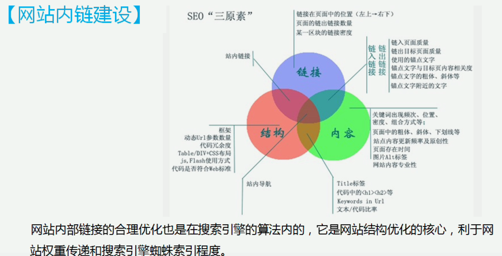

### 内链优化技巧

- 链接放置位置：按照用户浏览规则，从左到右，从上到下书顺序。**最佳位置：左上**
- 网站宣言
- 相关产品
- 关注 xxx 的网友还关注
- 热卖tag和热门搜索关键词，提高用户体验的同时构建了良好的内链
- 首发新品
- 每个文章都有2~3个tag，用tag来增加内链让页面互通，并且要把tag设为静态的
  - 产品类别：数码相机
  - 品牌：Samsung(三星)

#### 站内链接的优化方法

- 首页指向每一个频道页（也只想重要内容页）
- 频道页指向首页，也要指向各自的内容页
- 内容页指向每个频道页和首页及自己相邻的内容页（**P3较为重要**，所以没有返回连接至P2）

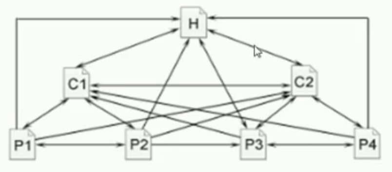

### 内链注意事项

- 尊重用户体验，注意**链接的相关性**，内部链接不要太过于泛滥。相关性高的链接有助于提高**搜索引擎收录**，并且有助于**提升用户体验**，**增加用户的黏性**，进而提升**网站的浏览量**。

- **内部链接**一定要保证**URL的唯一性**。特别是**动态网站静态化**处理过的，只能保留一个链接。链接到具体的页面都**只能有一个链接**，不能链接数多了，很容易导致**搜索引擎无法判断那个是正确的链接页面**，进而将之归入**重复页面**，从而**无法获得任何权重**。

- 内部链接要注意**防止死链和断链**。内部**链接的速度**同样是**衡量网站可靠性**的一个重要参数，一个好的空间或一台好的服务器很重要。

- 每个页面的内部链接数量要有控制。如果页面中的**内部链接数量超过限制**，**搜索引擎就可能会忽略该页面**，或者忽略该页面中超出限制的那部分**链接所指向的目标页面**。一般来说，一个页面的**内部链接数要限制在100**个以内。

## SEO优化内容

- 搜索按钮：热门标签
- 侧栏
  - 栏目列表
  - 推荐内容
  - 热点内容
- 上一篇/下一篇
- 相关文章列表
- 使用绝对地址

## 外链

- 外部链接：反向链接或导入链接，是指其他网站的链接指向你的网站
  - 单项外链：
  - 双向链接
- 交叉外链

### 什么是外链

> 外部链接，指将网页中的字串或图像链接外部网站的某一网页

- 友情链接是外链
- 关键词外链
- 图片外链

### 外链的意义

- 正价网站的权重
- 提高网站关键词排名
- 提高网站流量

### 外链的作用

- 提升网页PR值

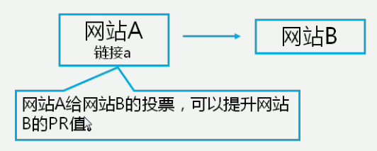

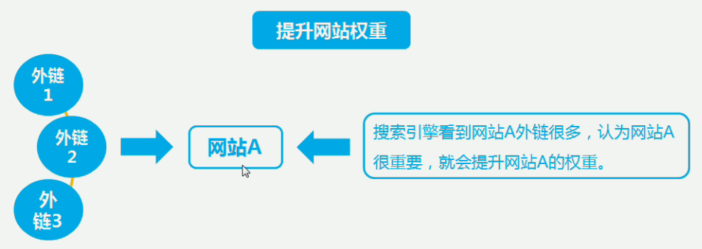

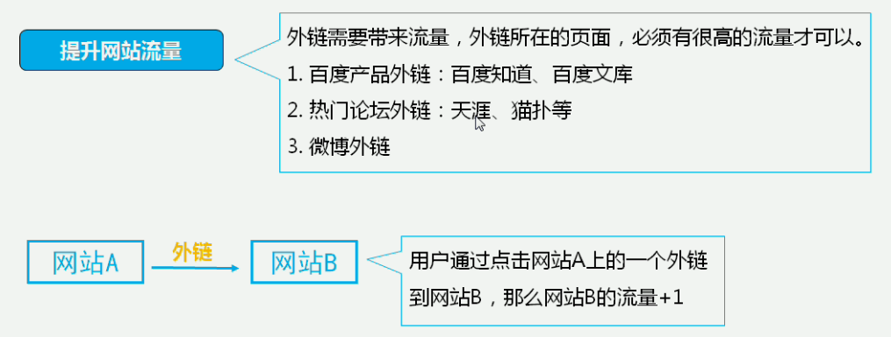

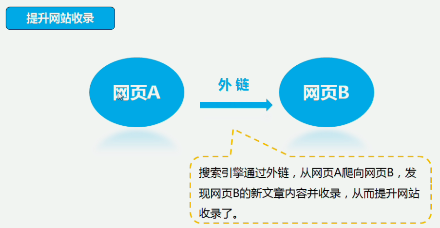

### 查询外链

- 搜索引擎查询
  - 谷哥查询：link: 网站域名地址
  - 百度查询：domain: 网站域名地址
- 工具查询
  - 爱站网：http://link.aizhan.com
  - 站长工具：http://outlink.chinaz.com

### 外链的注意事项

- 循序渐进，不要一下增加很多
- 注重质量，不要单纯性追求数量
- 内容相关性强

### 单向外链

#### 什么单向链接

> A 网页有链接指向B网页，而B网页没有链接指向A网页，这样的链接称为单项链接

- 而当A网页和B网页属于不同网站时，这个链接就叫做“单项外链”
- 单项外链的特点：不导出链接即获得外链

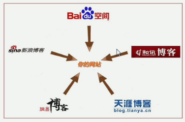

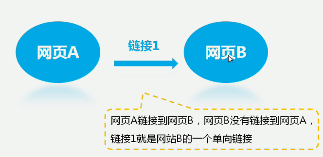

#### 单向外链的发布形式

单向外链可以发布到哪里呢？以什么形式呢？

- 哪里：博客、论坛等
- 形式：锚文本、超链接、纯文本
  - www.csdn.net

- 单向外链的形式
  - 文本形式
  - 超链接形式
  - 关键词超链形式


#### 单向外链的发布平台

- blog.csdn.net(博客)

### 双向链接

> 网A与网B互相链接

### 交叉链接

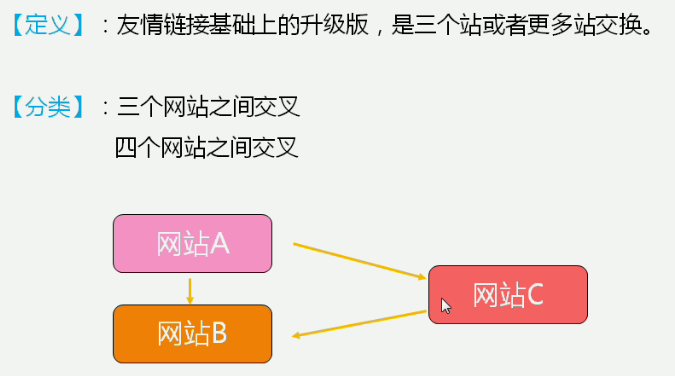

百度指数：index.baidu.com

案例：www.liuxue86.com

## 友情链接、链轮、黑链

### 友情链接

- 概念：互相在自己的网站放对方网站的链接
  - 形式：锚文本、图片
- 目的
  - 提升网站权重得到搜索引擎的重视
  - 提高关键词排名
  - 提高品牌知名度
- 交换
  - 行业相关、主题相似
  - 网站数据分析
    - 百度快照在7天之内：tool.chinaz.com
    - 对方网站至少与我方网站权重相同（对方越高越好）- **百度权重、Google**
    - 网站收录
    - 收录网页数量
    - 首页是否排第一位（site:wovert.com）,没有首页排第一位，有可能降权
    - 目标网站友情链接个数一般情况不超过50个
    - 有枪链接检测工具
  - 交换渠道
    - QQ群洽谈交换：友情链接交流群
    - 行业网站洽谈交换

### 链轮

> SEO Link Wheels是从国外引入国内的，一种比较新颖的SEO策略。是一种比较先进的网站营销方式。

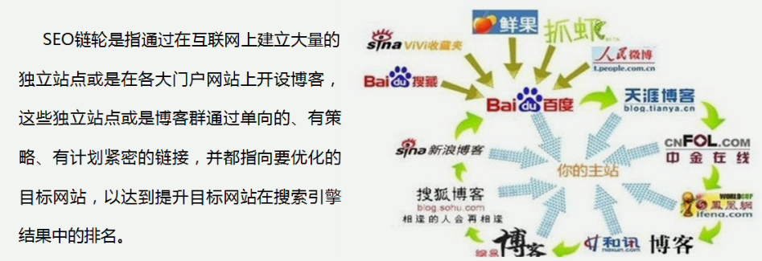

#### 链轮的作用

- 提升网站PR值
- 提升网页关键词排名
- 提升网页搜索引擎权重
- 提升网站知名度
- 提升网站流量

#### 链轮的模式

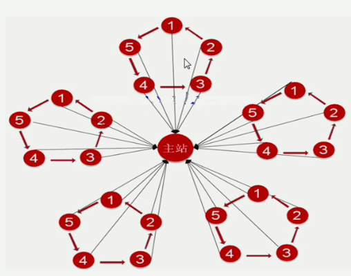

最常见的链轮，25个博客

### 黑链

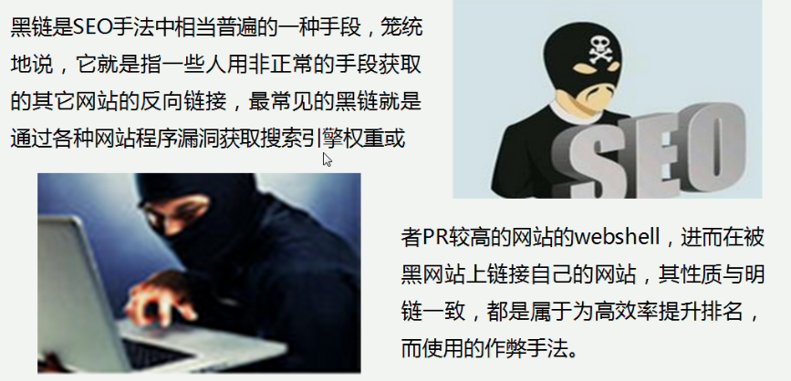

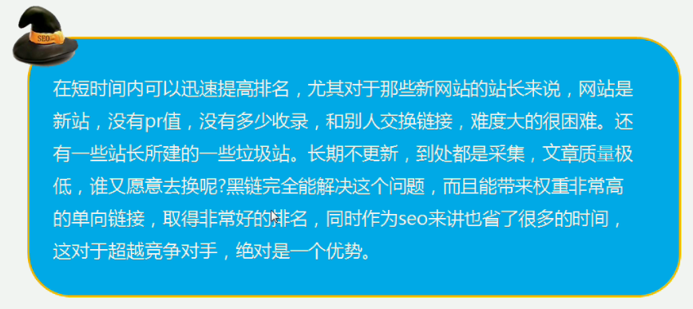

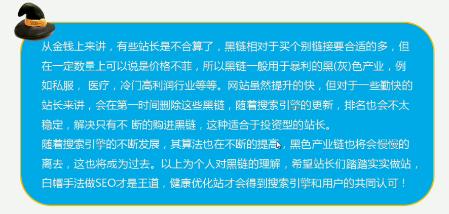

## nofollow 标签

> HTML 标签的属性值。搜素引擎不要追踪此网页上的链接或不要追踪此特定链接。如注册页、版权说明、公司信息等等。

```html
<a rel="nofollow">支付方式</a>
```

### nofollow 标签的作用

把一些不需要获取排名或者非重要页面进行nofollow后，把本来分散在这些非重要页面上的权重值转移到其他重要的页面上，提高其他页面权重。

## 外链增加方法与外链评估

## 增加外链练习

- 所在行业相关平台、论坛（至少5个产品类型的可以找交易平台，服务类型的找论坛）增加外链
- 百度（贴吧、空间、文库）增加外链
- 导航网站、dmoz目录提交，增加外链
- 博客平台（新浪、搜狐、网易、百度空间）增加外链
- 问答平台（百度知道、好搜问答、搜狐问问、天涯问答）

- 平台要求：相关的、PR高的，外链少的
- 软文要求：和自身业务相关，最好原创

### 增加外链方法

- 友情链接
  - 资源互换
    - 个人关系
    - 同类网站
    - 链接交换网站
      - 爱链网
  - 注意事项
    - 使用锚文本
    - 留意假PR值（PR劫持）
      - 利用跳转，通过欺骗手段后去比较高的PR值的显示
      - 一般搜索引擎在处理301和302转向的时候，都是把目标URL当做实际应该收录的URL
      - 这种网站对PR值没有任何贡献
      - 目的是卖链接
    - 判断nofollow
    - 避免导出链接过多（30以内链接）
  - 维护友情链接
    - 是否有**反链**（必须相互链接）
    - 对方链接的**网页快照**日期 —— 蜘蛛是否爬虫
    - 对方链接的**网站收录**量
  - 推荐工具：站长工具友情链接检测工具
    - [chianza](http://link.chinaz.com)
    - [linkhelper](http://inlink.linkhelper.cn)
    - [爱站](http://link.aizhan.com/)

- 论坛外链
  - 论坛外链增加方法
    - **帖子内容** -> 软文
    - 帖子**回复**
    - 签名档
  - 论坛外链注意事项
    - 内容外部
    - 选取可发布链接论坛

- 博客外链
  - 方法
    - 友情链接模块
    - 博客文章
    - 博客评论
  - 常用博客
    - 百度空间
    - 新浪博客
    - 网易博客
    - 搜狐博客
- 导航网站：网址导航网站排行榜
  - [hao123](wwww.hao123.com)
  - [2345](www.2345.com)
  - [114la](www.114la.com)
  - [360](hao.360.cn)
  - [sogou](123.sogou.com)
  - [wangdaizhijia](www.wangdaizhijia.com)
  - [265](www.265.com)
  - [1616](www.1616.net)
  - [baimin](www.baimin.com)

- 提交分类目录：[dmoz](www.dmoz.org)(我的网站到这个网站)
  - what
    - 通过人工的方式收集网站资源，并把这些拥有一定价值的网站资源通过人工的方式对它们的主题进行整理组织，存放在响应的目录下面，从而形成的网站分类目录的体系。
  - 注意事项
    - 不要提交未完成的站点
    - 避免网页有错误
    - 编写好的站点描述
    - 提交到不相关的目录
    - 避免镜像站重复提交（两个域名同一个网站）

- SNS社区增加外链
  - **日志**中增加外链
  - **评论**中增加外链

- 软文推广
  - 软文增加外链 -----添加网址链接-----> 软文
  - 软文A链接1 ---转载----> 软文B链接2
  - 软文发布方式
    - 门户网站付费发布
    - 论坛博客免费发布

- 问答平台
  - 注意事项
    - 每次增加数量：每个平台，每天增加的外链数不要超过3个
    - 外链放置位置：外链放置在回答内容中
    - 回答内容质量：根据提问详细作答，最后附上答案，有利用链接通过滤
  
- 百度产品增加外链
  - 百度知道：如果是自问自答，最好是隔天回答
  - 百度百科：质量高
    - 注册百度账号->查看**词条**是否存在（**百科**导航）->编写词条，填网址
    - 方法
      - 1.链接和内容相关
      - 2.未通过就修改，知道通过为止
      - 3.行文流畅，结构合理
  - 百度贴吧
    - 登录注册百度账号
    - 选择贴吧进行发帖
      - 在主贴中添加外链
      - 在回复中添加外链
  - 百度文库
    - 注册登录百度账号
    - 上传分享文档
    - 等待审核
    - 审核通过
      - 用户在百度文库下载你的分享文档，并通过这个文档的外链，进入浏览你的网站

- 链轮增加外链
  - 建立大量的独立站或是在大门户网站上开设博客，这些独立站或是博客群通过单项的、有策略、有计划紧密的链接，并都指向要优化的目标网站，已达到提升目标网站在搜索引擎结果中的排名。
  
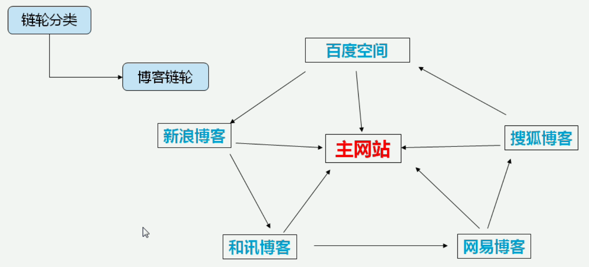

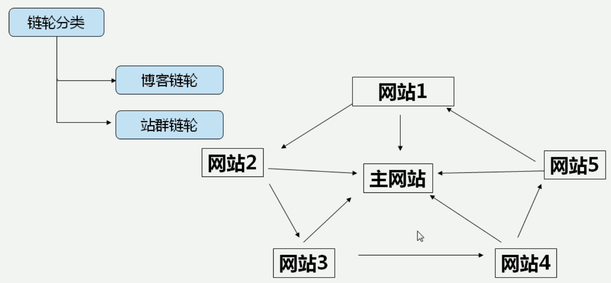

- 购买外链
  - 常用链接交易平台
    - 网链
    - 爱链网
    - 阿里微微
  - 注意事项
    - 网站外链数量（不要超过30个）
    - 判断是否假PR
    - 网页的快照
    - 谨防JS链接
    - 网站收录数量
    - 网站性质
      - 正规站，无论是自己或对方的网站，千万不能有私服、博彩、色情、外挂等网站进行外链

### 外链评估

- 高质量外链标准
  - **网站收录**
    - **收录总数**（网站**收录越**多，说明**搜索引擎对网站友好度高**，那搜素引擎，对网站上的外链，也将是有好的）
    - **收录速度**：（快照时间，收录速度越快，说明搜索引擎来网站的频率越高，那通过外链到达目的页面的评率也就自然高了）
    - **收录比例**：收录了多好个页面
    - **收录稳定性**：是否有波动性
  - **网页快照**
    - 快照当前：今天日期：2014-12-2， 网页快照：204-12-2
    - 快照隔天：今天日期：2014-12-2， 网页快照：204-12-1
    - 快照3天内：今天日期：2014-12-2， 网页快照：204-11-29
  - **导出外链数量**
    - 对**所在页面**影响
      - 网站A导出外链过多，导致被搜索引擎惩罚（超出**100**个以上比较危险）
        - 超出100个外链对我的网站没有多大帮助
        - 只有几个外链对很要必要做外链
    - 对**所指页面**影响
      - 网站B：网站B从网站A那里获得权重很好
      - 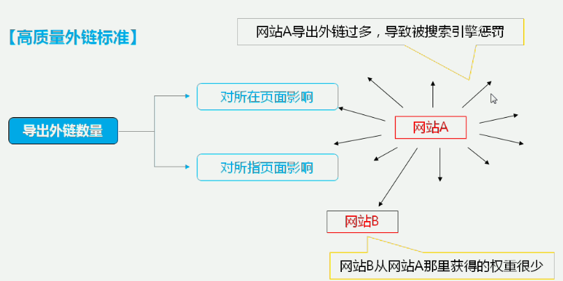

  - **相关性**
    - **网站类型**：同类型网站相关度较高，用户体验上来讲，如果在A网站找不到相关内容吗，会通过链接转到B网站
    - **页面内容**：不同类型的网站或栏目中，可以根据相关的正文内容或关键词添加相关链接
  - **信任度**
    - 域名年龄
    - 网站规模（内容）
    - 信息质量（原创）
  - **网站alexa排名**
    - 网站A Alexa排名考勤啊 ----------> 搜索引擎带来流量多 ------>网站A权重和排名都较好 ----> 网站A导出的外链，分出的权重高
  - **网页PR值**
    - 网站A PR值越高 ------> 外链导出的PR值就高，

## 百度绿萝算法

> 2013-2-19 上线的一种搜索引擎反作弊的算法。

- 主要打击超链中介、出卖链接、购买链接等超作弊行为。该算法的推出有效制止恶意交换链接，发布外链的行为，有效净化互联网生态圈。

## 统计分析与白皮书分析

- **IP**: 电脑的编号（外网IP）
- **PV**：浏览量，用户每打开一个页面就被记录一次，多次打开同一个页面就被记录一次，多次打开同一个页面则累计
- **UV**：独立访客，一台电脑为一个，一天之内只算一次（内网数量）
- **跳出率**：只浏览一个页面就跳出页面，占总访问次数的比例

### 统计

> 多使用统计，比较参照参数

- cnzz
- 51啦统计
- 百度统计

- 环比：环比：与上一统计段比较就是与前一个相邻的时期作比较，例如2005年7月份与2005年6月份相比较，叫环比
- 同比：与历史同时期比较，就是与不同年份的同一时期作比较，例如2005年7月份与2004年7月份相比，叫同比。如图2012年5月与2013年5月对比就叫做同比。
- 同比增长：与上一年同一时期相比的增长情况。
- 环比增长：与之紧紧相邻的上一个统计周期相比较的增长情况，包括年环比、月环比、日环比。

[网站](https://ziyuan.baidu.com/college/documentinfo?id=234)

## 总结

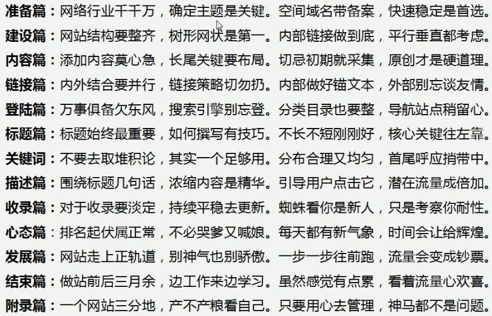
